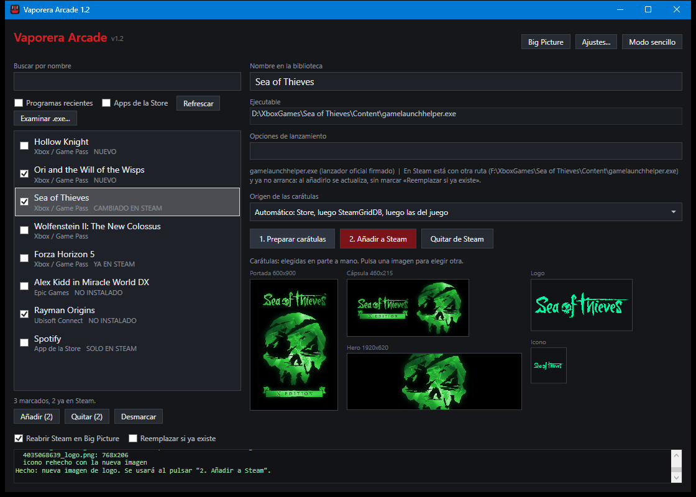

# Vaporera Arcade

*[Versión en español](README.md) (the full documentation).*

Adds the games you installed from other platforms (Xbox Game Pass, Epic Games, GOG, Ubisoft
Connect, Microsoft Store…) to your Steam library in a couple of clicks, with their artwork.

Steam lets you add "non-Steam games", but by hand: you have to find the executable, work out
how each game is launched and get images of the right size. Vaporera Arcade does it for you.
It detects what you have installed, downloads the official artwork and creates the shortcut,
so the game shows up in Big Picture like any other.

> **The interface and the log are in Spanish only.** This page explains what you need to use
> it anyway. The [Spanish README](README.md) has the full details.



## Features

- **Detects installed games** from Xbox / Game Pass, Ubisoft Connect, Epic Games, GOG,
  Microsoft Store apps and recently run programs, or any `.exe` you pick by hand. Each one is
  launched the way its platform expects (Epic and Ubisoft through their launcher's URI, Xbox
  through `gamelaunchhelper.exe`).
- **Generates every image Steam uses:** cover, capsule, hero, logo and icon.
- **Preview before touching Steam.** Click any image to pick another one from the Microsoft
  Store or SteamGridDB, load your own from disk, or pick the right game when the search found
  the wrong one.
- **Several games at once:** tick them and add or remove them all with a single Steam
  restart.
- **Marks the games already in Steam**, backs up `shortcuts.vdf` before every write and
  restarts Steam when done (optionally in Big Picture).
- **Removes** a game it added, together with its artwork.
- **Tells you what needs a look**: games that are **new** since last time, games whose Steam
  shortcut points to an old path (added again, they are fixed in place and keep their
  artwork), and shortcuts still in Steam for games that are **no longer installed**.
- **Remembers the checkboxes** and the artwork source for next time.
- **Works with the keyboard or an Xbox (or compatible) controller**, no mouse needed.
- **Simple mode**: just the games, in large print, to tick them and add or remove them with
  the controller.
- **Adds itself to Steam**, with its own artwork, so you can open it from Big Picture with the
  controller.

## Requirements

- Windows 10 or 11, with the built-in Windows PowerShell 5.1 (PowerShell 7 is not needed).
- Steam installed, with at least one account that has logged in on the PC.
- An internet connection for the artwork. Without it, the artwork is built from the images
  that come with the game.
- Optional: an Xbox controller or one compatible with XInput (many have an "X-input" mode).

## Installation

1. Download the project (**Code → Download ZIP**) and unzip it to a folder you can write to,
   for example `Documents\Vaporera Arcade`.
2. Double-click **`CrearAccesoDirecto.cmd`** ("create shortcut"). It unblocks the downloaded
   files and creates a **Vaporera Arcade** shortcut that opens the app without a console
   window.

The app is **portable**: the unzipped folder *is* the program. Nothing is installed and the
registry is not touched. Don't move or delete the folder afterwards, or the shortcut will stop
working (if you move it, run `CrearAccesoDirecto.cmd` again from the new place).

Windows SmartScreen or your antivirus may warn you, because the scripts are downloaded from
the internet and are not signed. The code is plain text: you can read it before running it.

## Usage

Open the **Vaporera Arcade** shortcut, or run:

```powershell
powershell -ExecutionPolicy Bypass -STA -File .\VaporeraArcade.ps1
```

1. Pick a game from the list (*Buscar por nombre* filters it).
2. Optionally change the name it will have in Steam (*Nombre en la biblioteca*) or its launch
   options (*Opciones de lanzamiento*).
3. Click **1. Preparar carátulas** ("prepare artwork") and check the preview. The same button
   cancels while it works.
4. To change an image, click it. The window that opens shows other options; it also has
   **Cargar imagen…** (load your own image) and **Elegir otro juego…** (search for the right
   game when the artwork belongs to a different one). That choice is remembered, even after
   closing the app: from then on the artwork of that game comes from the one you picked,
   which is shown above the *Origen de las carátulas* list (*Elegido a mano*, "picked by
   hand"). Click **Olvidar** ("forget") next to it to go back to searching by name.
5. Click **2. Añadir a Steam** ("add to Steam"). The app closes Steam, adds the game, copies
   the images and opens Steam again.

To undo it, select a game marked **YA EN STEAM** ("already in Steam") and click **Quitar de
Steam** ("remove from Steam").

To add or remove several games at once, tick their boxes in the list and click **Añadir (N)**
("add") or **Quitar (N)** ("remove") below it. Steam is closed only once for all of them. When
adding, the artwork of each game is prepared first (the prepare button becomes **Cancelar**,
"cancel"); games already in Steam are skipped. The log ends with a summary.

Below each game's name, the list shows where it comes from and, when it matters, a tag. The
ones that need something go first:

| Tag | Meaning | What to do |
|---|---|---|
| **NUEVO** | New: a game from Xbox / Game Pass, Epic, GOG or Ubisoft that wasn't there the last time you opened the app. | Add it, if you want. |
| **CAMBIADO EN STEAM** | Changed: it's in Steam under its name but with another executable (the game was moved, or an update renamed its `.exe`), so the Steam shortcut no longer starts it. | Add it again, without *Reemplazar si ya existe*: the shortcut is updated in place. With *Añadir (N)* it keeps the artwork it had. |
| **YA EN STEAM** | Already in Steam. | Nothing, or remove it. |
| **NO INSTALADO** | Not installed: in Steam, but the game is gone. | Remove it (that's all it allows). |
| **SOLO EN STEAM** | Only in Steam: not found by the search (added by hand or by another tool, or from an unticked box). | Remove it, if you no longer want it. |

To spot new games, `config.json` keeps a 16-character fingerprint of each game's executable,
not its path or name. Nothing is tagged as new the first time the app runs.

The app remembers *Reabrir Steam en Big Picture*, *Apps de la Store*, *Programas recientes* and
the artwork source. *Reemplazar si ya existe* always starts unticked, so it never replaces
games by surprise.

### Keyboard, controller and Big Picture

Everything works without a mouse. Keyboard: Tab (and Shift+Tab) moves between controls, the
arrows move through the list and the image gallery, **Enter** presses (and selects the game
that has the focus), **Space** ticks a game, **Escape** closes the open window and **F4** opens
the artwork source list.

Controller: the D-pad or left stick moves (holding repeats), **A** presses whatever has the
focus, **B** closes, **X** ticks a game in the list, **LB / RB** go to the previous / next
control. The controller only drives the app while its window is in front. Typing (name,
search, SteamGridDB key) still needs a keyboard, real or Windows' on-screen one.

**To open it from Big Picture**, click **Añadir Vaporera a Steam** ("add Vaporera to Steam"),
top right: it adds the app to your library with its own artwork (Steam is restarted). The
button goes away once it's added; if you move the app's folder it comes back as **Actualizar
Vaporera en Steam** ("update") to fix the path. **Big Picture**, next to it, opens Steam in Big
Picture and closes the app, like quitting a game.

**Modo sencillo** ("simple mode"), top right, leaves only the games list in large print and
two buttons, **Añadir marcados** ("add ticked") and **Quitar marcados** ("remove ticked").
Tick games with **A** or **X** (Enter or Space on the keyboard) and press *Añadir marcados*.
Only games from Xbox / Game Pass, Epic, GOG and Ubisoft are shown (new ones first), plus the
ones tagged **NO INSTALADO** so you can remove them with the controller. Everything else (artwork
source, Big Picture, replace) is taken from the full window, **Modo avanzado** ("advanced
mode"). The app opens in the last mode you used. After adding successfully, the app **closes
itself**, because the restarted Steam would cover it. If something fails, it stays open and
says so below the buttons.

In both modes, whenever adding or removing goes well and Steam is reopened in Big Picture
(*Reabrir Steam en Big Picture*), the app closes too.

## Where the artwork comes from

1. **Microsoft Store**, the official art, with no key needed. The catalog is queried with the
   country and language of your Windows regional settings (Spain if the Store doesn't know
   that country).
2. **SteamGridDB**, optional. Get a free API key in your
   [SteamGridDB profile](https://www.steamgriddb.com/profile/preferences/api), click
   **Ajustes…** ("settings") in the app, paste it and click **Probar** ("test").
3. **The game's own images**, if nothing else is found.

## Privacy

There is no server and no telemetry. The app only talks to the Microsoft Store catalog
(`displaycatalog.mp.microsoft.com`, `storeedgefd.dsx.mp.microsoft.com`) and, if you set a key,
to `www.steamgriddb.com`, sending the game name or Store id, your Windows country and language,
and your SteamGridDB key.

Everything it keeps stays on your PC: the SteamGridDB key (in plain text) and the games you
picked by hand for the artwork (each with the path of the game's executable), your checkbox
settings and the fingerprints of the games already seen (no paths) in
`%LOCALAPPDATA%\VaporeraArcade\config.json`, and a log in the same folder. The log contains
full paths, installed game names and your Steam profile id: review it before sharing it.

## Known limitations

- Xbox / Game Pass games and Store apps: Steam shows no overlay and doesn't track play time,
  because the launcher starts the game and exits.
- If a game's executable changes, its Steam id changes and the shortcut stops working. The
  list tags it **CAMBIADO EN STEAM**: add it again and it is updated. If you renamed it inside
  Steam, the app can't tell it's the same game and the old shortcut shows up on its own.
- Steam has to be closed to edit `shortcuts.vdf`. The app closes it itself and cancels without
  changing anything if Steam doesn't close within 40 seconds.
- The controller has to be XInput (Xbox or compatible). PlayStation and Switch controllers
  work through Steam Input or tools like DS4Windows.

## Disclaimer

A personal project, not affiliated with Valve, Microsoft, Epic Games, GOG or Ubisoft. It uses
undocumented Microsoft Store services that could change or stop working at any time. It
modifies Steam's `shortcuts.vdf`; it always makes a backup first, but use it at your own risk.

## License

[MIT](LICENSE).
