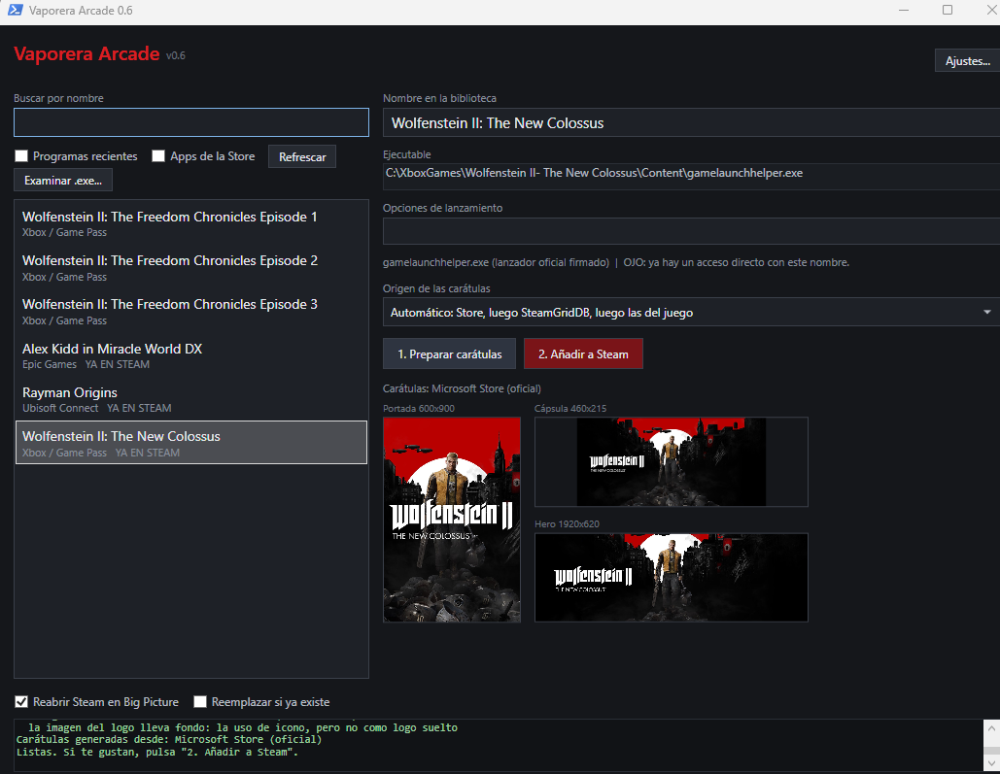

# Vaporera Arcade

Añade a tu biblioteca de Steam los juegos de otras plataformas (Xbox Game Pass, Epic Games,
GOG, Ubisoft Connect, Microsoft Store…) con un par de clics, y con sus carátulas.

Steam permite añadir «juegos que no son de Steam», pero a mano: hay que buscar el ejecutable,
averiguar cómo se lanza cada juego y conseguir las imágenes con el tamaño correcto. Vaporera
Arcade lo hace por ti. Detecta lo que tienes instalado, descarga el arte oficial y crea el
acceso directo, de modo que el juego aparece en Big Picture como uno más.



## Características

- **Detección automática** de los juegos instalados, según su origen:

  | Origen | Dónde lo busca | Cómo lo lanza |
  |---|---|---|
  | Xbox / Game Pass | `<unidad>\XboxGames\*\Content\` | `gamelaunchhelper.exe`, el lanzador oficial |
  | Ubisoft Connect | Registro de Windows | `UbisoftConnect.exe` con `uplay://launch/<id>/0` |
  | Epic Games | Manifiestos de `ProgramData\Epic` | El ejecutable del juego |
  | GOG ¹ | Registro de Windows | El ejecutable del juego, con los argumentos del registro |
  | Apps de la Microsoft Store | Menú Inicio | `explorer.exe shell:AppsFolder\<AUMID>` |
  | Programas recientes | Historial de ejecución de Windows | El ejecutable |
  | Cualquier otro | Botón *Examinar .exe…* | El ejecutable |

  Las apps de la Store y los programas recientes están desactivados por defecto, porque llenan
  la lista de cosas que no son juegos. Se activan con sus casillas.

  ¹ **GOG está sin confirmar.** Es el único origen que no se ha podido probar con un juego
  instalado de verdad, porque no había GOG Galaxy en el equipo donde se desarrolla. Debería
  funcionar, pero si tienes juegos de GOG y algo no va, [abre una issue](https://github.com/spaizor/vaporera-arcade/issues).

- **Carátulas automáticas.** Genera las imágenes que usa Steam: portada, cápsula, hero,
  logo e icono.
- **Vista previa.** Puedes ver las carátulas antes de modificar nada en Steam.
- **Marca los juegos que ya están en Steam** y los muestra al final de la lista. Se consideran
  repetidos los que tengan el mismo nombre, o el mismo ejecutable con las mismas opciones.
- **Copia de seguridad** de `shortcuts.vdf` antes de cada escritura.
- **Reabre Steam** al terminar, en Big Picture si lo prefieres.
- **Modo consola** para usarlo sin ventana.

## Requisitos

- Windows 10 u 11.
- Windows PowerShell 5.1, que ya viene instalado en Windows. No hace falta PowerShell 7.
- Steam instalado, con al menos una sesión iniciada en el equipo.
- Conexión a internet para descargar las carátulas. Sin conexión, las compone con las imágenes
  que traiga el propio juego.

## Instalación

1. Descarga el proyecto (botón **Code → Download ZIP**) y descomprímelo en una carpeta
   donde tengas permiso de escritura, por ejemplo `Documentos\Vaporera Arcade`.
2. Haz doble clic en **`CrearAccesoDirecto.cmd`**. Desbloquea los ficheros descargados y crea
   el acceso directo **Vaporera Arcade**, que abre la aplicación sin ventana de consola.

   Si prefieres la consola, o quieres el acceso directo en más sitios:

   ```powershell
   powershell -ExecutionPolicy Bypass -File .\CrearAccesoDirecto.ps1 -Escritorio -MenuInicio
   ```

   Las mismas opciones valen con el `.cmd` (`CrearAccesoDirecto.cmd -Escritorio`), y con
   `-Quitar` se borran los accesos directos creados.

   > Es el `.cmd` y no el `.ps1` porque **Windows no ejecuta los `.ps1` con doble
   > clic**: los abre en un editor. El `.cmd` solo llama al script de al lado.

**Vaporera Arcade es portable: la carpeta que has descomprimido *es* el programa.** No se
instala nada: el script no copia nada a ningún otro sitio ni toca el registro de Windows;
solo desbloquea los ficheros y crea un acceso directo que apunta a esta misma carpeta.
Descomprime donde quieras tenerlo de forma permanente y **no la borres ni la muevas**
después, o el acceso directo dejará de funcionar (si la mueves, vuelve a ejecutar
`CrearAccesoDirecto.cmd` desde la nueva ubicación). Lo único que sobra al terminar es el ZIP
descargado.

> **SmartScreen y antivirus.** Windows marca como peligroso todo lo que se descarga de
> internet, y un `.ps1` bajado de la red dispara además el aviso de la directiva de ejecución.
> Por eso el script se lanza con `-ExecutionPolicy Bypass` y lo primero que hace es
> `Unblock-File` sobre los ficheros de la carpeta. Si tu antivirus protesta, es por el mismo
> motivo: un script que no está firmado. Puedes leer los scripts antes de ejecutarlos, que para
> eso el código está a la vista.

> **Importante:** los ficheros `.ps1` están guardados en UTF-8 **con BOM**. Si los editas,
> mantén esa codificación; si no, PowerShell 5.1 mostrará mal las tildes y la ñ.

## Uso

### Con ventana

Haz doble clic en el acceso directo **Vaporera Arcade** que creó `CrearAccesoDirecto.cmd`. Abre la
aplicación sin mostrar la consola. También puedes ejecutar el script a mano:

```powershell
powershell -ExecutionPolicy Bypass -STA -File .\VaporeraArcade.ps1
```

1. Elige un juego de la lista. Puedes filtrarla con el buscador.
2. Si quieres, cambia el nombre con el que aparecerá en Steam o las opciones de lanzamiento.
3. Pulsa **1. Preparar carátulas** y revisa la vista previa.
4. Pulsa **2. Añadir a Steam**. La aplicación cierra Steam, añade el juego, copia las imágenes
   y vuelve a abrir Steam.

Para deshacerlo, **Quitar de Steam** (ver *Quitar un juego*).

Casillas de la parte inferior:

- **Reabrir Steam en Big Picture:** al terminar abre Steam directamente en modo Big Picture.
- **Reemplazar si ya existe:** sobrescribe el acceso directo si ya había uno con el mismo
  nombre o el mismo ejecutable.

### Modo consola

```powershell
powershell -ExecutionPolicy Bypass -File .\VaporeraArcade.ps1 -Consola
```

Con `-Juego` filtra la lista por nombre:

```powershell
powershell -ExecutionPolicy Bypass -File .\VaporeraArcade.ps1 -Consola -Juego "Forza"
```

## De dónde salen las carátulas

Por orden de preferencia:

1. **Microsoft Store.** Los juegos de Xbox / Game Pass indican su identificador de la Store
   en `MicrosoftGame.config`. Con él, el catálogo público de la Store devuelve el arte oficial
   del juego sin necesidad de claves. En los juegos de otros orígenes se busca por el nombre.
2. **SteamGridDB** (opcional). Se usa cuando la Store no tiene el juego. Necesita una clave de
   API, que es gratuita: consíguela en tu [perfil de SteamGridDB](https://www.steamgriddb.com/profile/preferences/api),
   pulsa **Ajustes…** en la aplicación, pégala y usa **Probar** para comprobar que funciona.
   Se guarda en `%LOCALAPPDATA%\VaporeraArcade\config.json`, fuera de la carpeta de la aplicación.
3. **Imágenes del propio juego.** Si no hay nada más, compone las carátulas con el fondo y el
   logo que trae el juego instalado.

Cuando se busca por el nombre, se compara el título de cada resultado con el del juego y se
descarta el que no cuadre, en vez de quedarse con el primero: buscar el ejecutable `obs64` no
trae la carátula de otro programa, y buscar `Forza Horizon 5` no devuelve la de `Forza
Horizon 6`. Lo descartado queda anotado en el registro. El precio es que un juego cuyo nombre
detectado no se parece al real (los de Ubisoft salen como `ACValhalla`) se queda con las
imágenes que trae instaladas.

Con el desplegable **Origen de las carátulas** puedes forzar de dónde salen:

| Opción | Qué hace |
|---|---|
| Automático | Store, luego SteamGridDB, luego las imágenes del juego (lo normal) |
| Solo Microsoft Store | No consulta SteamGridDB |
| Solo SteamGridDB | Se salta el catálogo de la Store |
| Solo imágenes del propio juego | No consulta nada por internet |

Imágenes que se generan en `Steam\userdata\<usuario>\config\grid\`:

| Fichero | Tamaño | Dónde se ve |
|---|---|---|
| `<appid>p.png` | 600×900 | Portada vertical de la biblioteca y de Big Picture |
| `<appid>.png` | 460×215 | Cápsula horizontal |
| `<appid>_hero.png` | 1920×620 | Cabecera de la página del juego |
| `<appid>_logo.png` | Variable | Logo sobre la cabecera |
| `<appid>_icon.png` | 256×256 | Icono de la lista |

El logo solo se genera cuando la imagen encontrada es un logo de verdad: transparente o
apaisado. El catálogo de la Store devuelve muchas veces la baldosa cuadrada del menú Inicio,
que con su fondo encima de la cabecera queda mal; esa imagen se aprovecha para el icono.

El icono no lo busca Steam por el nombre del fichero: lo saca del campo `icon` del acceso
directo, y la aplicación lo apunta al `_icon.png` generado. Si el juego no tiene arte en
internet ni imágenes propias, ese campo se queda apuntando al `.exe` y Steam usa su icono.

## Limitaciones conocidas

Son limitaciones de Steam y de cada plataforma, no de esta aplicación:

- **Xbox / Game Pass:** Steam no muestra el overlay ni cuenta las horas de juego.
  `gamelaunchhelper.exe` arranca el juego y termina, así que Steam deja de seguir el proceso.
- **Apps de la Microsoft Store:** ocurre lo mismo. Además, la ventana puede quedar detrás de
  Big Picture.
- **Si cambia el ejecutable de un juego, cambia su identificador en Steam** y las carátulas
  dejan de aparecer. Vuelve a añadirlo con la casilla *Reemplazar si ya existe* marcada.
- **Steam tiene que cerrarse** para modificar `shortcuts.vdf`; si no, lo sobrescribe al salir.
  La aplicación lo cierra sola y espera hasta 40 segundos. Si no se cierra, cancela la operación
  sin tocar nada.

## Privacidad y conexiones

Vaporera Arcade no tiene servidor propio, no registra ningún uso y no envía nada a su autor.
Todo lo que hace se queda en tu equipo, salvo las consultas necesarias para conseguir las
carátulas.

**A qué se conecta:**

| Servicio | Cuándo | Qué se envía |
|---|---|---|
| `displaycatalog.mp.microsoft.com` | Al preparar carátulas de un juego con identificador de la Store | El identificador del producto |
| `storeedgefd.dsx.mp.microsoft.com` | Al buscar en el catálogo de la Store por nombre | El nombre del juego |
| `www.steamgriddb.com` | Solo si has configurado una clave de API | El nombre del juego y tu clave |

Después se descargan las imágenes desde las direcciones que devuelvan esos servicios, que
apuntan a sus propias redes de distribución. Ninguna petición lleva tu nombre de usuario, el
del equipo ni ningún identificador que apunte a ti: el único dato fijo que se manda es la
cabecera `MS-CV: VaporeraArcade.1`, un valor de trazas que es igual para todo el mundo. Con
el origen de las carátulas en **Solo imágenes del propio juego** no se conecta a nada.

**Qué se guarda en tu equipo:**

- `%LOCALAPPDATA%\VaporeraArcade\config.json`: tu clave de SteamGridDB, **en texto plano**.
  No está cifrada ni ofuscada. Si compartes ese fichero, compartes la clave.
- `%LOCALAPPDATA%\VaporeraArcade\vaporera-arcade.log`: el registro de actividad. Contiene
  **rutas completas** (que incluyen tu nombre de usuario de Windows), los nombres de los juegos
  que tienes instalados y el **identificador de tu perfil de Steam**. Míralo antes de pegarlo
  en una incidencia de GitHub o de enviárselo a nadie. Crece sin límite: puedes borrarlo cuando
  quieras y se vuelve a crear.
- `%TEMP%\VaporeraArcade\<appid>\`: las imágenes a medio preparar de cada juego (~1,6 MB por
  juego). Al abrir la aplicación se borran las que tengan más de un día.
- En la carpeta de Steam: el acceso directo en `shortcuts.vdf`, sus copias de seguridad
  `shortcuts.vdf.bak-<fecha>` y las imágenes de `userdata\<usuario>\config\grid\`.

**Desinstalar del todo:**

1. Borra la carpeta de la aplicación. Si creaste accesos directos en el Escritorio o en el
   menú Inicio, quítalos antes con `CrearAccesoDirecto.cmd -Quitar -Escritorio -MenuInicio`.
2. Borra `%LOCALAPPDATA%\VaporeraArcade` (ajustes, clave y registro).
3. Borra `%TEMP%\VaporeraArcade` (imágenes temporales).
4. Si además quieres deshacer lo hecho en Steam, quita los juegos añadidos antes de borrar la
   aplicación (ver *Quitar un juego*) y borra los `shortcuts.vdf.bak-*` de la carpeta `config`
   de tu perfil de Steam.

## Quitar un juego

Elige en la lista un juego marcado como **YA EN STEAM** y pulsa **Quitar de Steam**. Tras
confirmar, la aplicación cierra Steam, hace una copia de seguridad de `shortcuts.vdf`, quita el
acceso directo y borra sus carátulas de `config\grid\`. El juego no se desinstala. Steam se
vuelve a abrir solo si estaba abierto.

También puedes quitarlo desde Steam (clic derecho sobre el juego → *Administrar* y la opción
para quitarlo de la biblioteca), pero entonces sus carátulas se quedan en `config\grid\`. O,
con Steam cerrado, desde PowerShell en la carpeta de la aplicación:

```powershell
. .\lib\Vdf.ps1
. .\lib\SteamCtl.ps1
$s = Get-SteamInfo
Backup-Shortcuts -Ruta $s.Shortcuts
foreach ($id in Remove-SteamShortcut -RutaVdf $s.Shortcuts -Nombre 'Nombre exacto del juego') {
    Remove-CaratulasHuerfanas -RutaVdf $s.Shortcuts -GridDir $s.GridDir -AppId $id
}
```

Al reemplazar un acceso directo con otro nombre o ejecutable, las carátulas del anterior
también se borran.

## Cómo funciona por dentro

```
Vaporera Arcade
├── VaporeraArcade.ps1           aplicación: ventana WPF y modo consola
├── CrearAccesoDirecto.cmd       lanzador del script de al lado (doble clic)
├── CrearAccesoDirecto.ps1       desbloquea los ficheros y crea el acceso directo
└── lib
    ├── Config.ps1               ajustes del usuario (config.json en %LOCALAPPDATA%)
    ├── Vdf.ps1                  lectura y escritura del formato VDF binario y cálculo del appid
    ├── Fuentes.ps1              detección de juegos según su origen
    ├── Caratulas.ps1            descarga y composición de carátulas
    └── SteamCtl.ps1             localizar, cerrar y abrir Steam, y editar shortcuts.vdf
```

Los ajustes y el registro de actividad se guardan fuera de la carpeta de la aplicación, en
`%LOCALAPPDATA%\VaporeraArcade\`: `config.json` (la clave de SteamGridDB) y
`vaporera-arcade.log`. Así funciona también instalada en una carpeta sin permiso de escritura,
como `Archivos de programa`. Si algo falla, el detalle del error está en ese `.log`. La primera
línea de cada arranque lleva la versión de la aplicación, el modo, la versión de PowerShell y la
de Windows: es lo que conviene adjuntar al informar de un fallo. La versión también aparece
junto al nombre en la cabecera de la ventana.

- **`shortcuts.vdf` se lee entero y se vuelve a escribir** a partir de su estructura, no
  insertando bytes sueltos. Leer el fichero y guardarlo sin cambios produce un fichero idéntico
  byte a byte.
- **El appid** de un acceso directo es `CRC32(exe_entre_comillas + nombre) | 0x80000000`, el
  mismo cálculo que hace Steam. Por eso las carátulas se asocian al juego correcto.
- Las entradas nuevas tienen la misma estructura que las que crea Steam.

## Historial de versiones

- **0.6** (22-09-2026): detección más robusta en equipos distintos al de desarrollo. Los
  juegos de Xbox se buscan en la carpeta real (`.GamingRoot`) y solo en unidades fijas; Epic
  se lanza por la URI del lanzador; GOG respeta los argumentos y la carpeta de inicio del
  registro; el perfil de Steam se elige por la sesión activa y se avisa cuando falta Steam o
  no hay ningún perfil. Además, un origen que falle ya no deja la lista vacía, `shortcuts.vdf`
  se escribe de forma atómica y la ventana no acepta acciones a medio escribir.
- **0.5** (18-09-2026): primera versión numerada. Detección de Xbox Game Pass, Epic Games, GOG,
  Ubisoft Connect, apps de la Microsoft Store y programas recientes; carátulas desde el catálogo
  de la Store, SteamGridDB o las imágenes del propio juego, con vista previa antes de tocar
  Steam; copia de seguridad de `shortcuts.vdf` en cada escritura y modo consola.

## Aviso

Vaporera Arcade es un proyecto personal y no tiene relación con Valve, Microsoft, Epic Games,
GOG ni Ubisoft. Usa servicios no documentados del catálogo de la Microsoft Store, que podrían
cambiar o dejar de funcionar en cualquier momento.

La aplicación modifica `shortcuts.vdf` de Steam. Siempre hace una copia de seguridad antes
(`shortcuts.vdf.bak-<fecha>`, en la misma carpeta; se conservan las 10 últimas), pero úsala
bajo tu responsabilidad.

## Licencia

Distribuido bajo la licencia [MIT](LICENSE). Puedes usarlo, modificarlo y compartirlo
libremente, siempre que mantengas el aviso de copyright.
